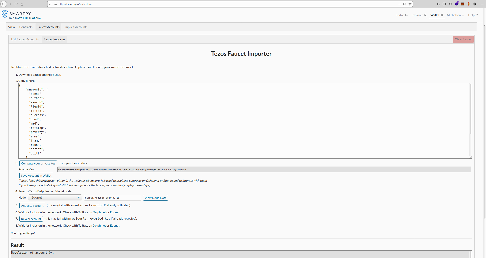
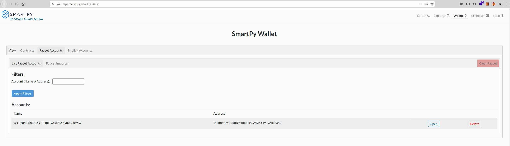
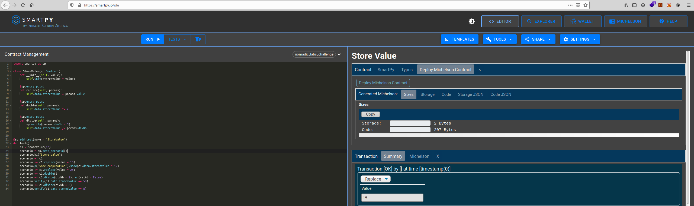
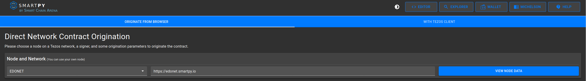
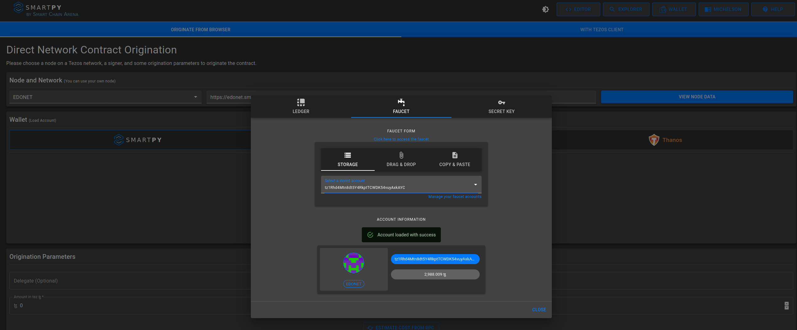
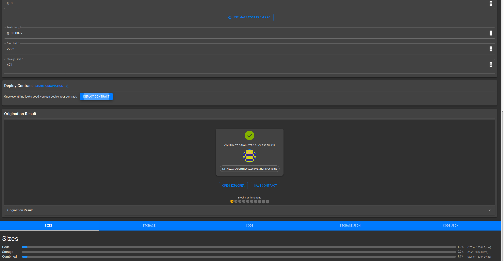
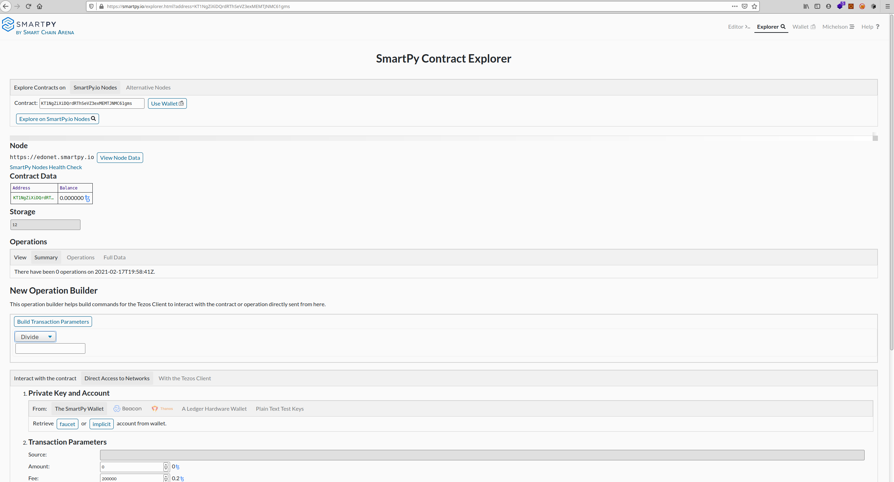
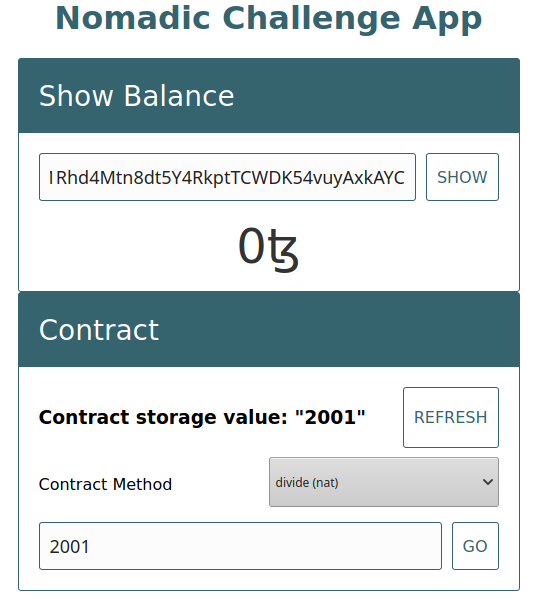

- [1. Nomadic Lab technical challenge](#1-nomadic-lab-technical-challenge)
  - [1.1. Smart Contract](#11-smart-contract)
  - [1.2. Run testnet node](#12-run-testnet-node)
  - [1.3. Deploying a smart contract to the Edo Tezos testnet](#13-deploying-a-smart-contract-to-the-edo-tezos-testnet)
  - [1.4. Launching the app](#14-launching-the-app)


# 1. Nomadic Lab technical challenge

## 1.1. Smart Contract
You can find the smart contract in the smart contract folder, [here](smart-contract/stored-value.py)

The code is the following:
```python
import smartpy as sp

class StoreValue(sp.Contract):
    def __init__(self, value):
        self.init(storedValue = value)

    @sp.entry_point
    def replace(self, params):
        self.data.storedValue = params.value

    @sp.entry_point
    def double(self, params):
        self.data.storedValue *= 2

    @sp.entry_point
    def divide(self, params):
        sp.verify(params.divNb > 5)
        self.data.storedValue /= params.divNb


@sp.add_test(name = "StoreValue")
def test():
    c1 = StoreValue(12)
    scenario = sp.test_scenario()
    scenario.h1("Store Value")
    scenario += c1
    scenario += c1.replace(value = 15)
    scenario.p("Some computation").show(c1.data.storedValue * 12)
    scenario += c1.replace(value = 25)
    scenario += c1.double()
    scenario += c1.divide(divNb = 2).run(valid = False)
    scenario.verify(c1.data.storedValue == 50)
    scenario += c1.divide(divNb = 6)
    scenario.verify(c1.data.storedValue == 8)
```

## 1.2. Run testnet node
To run and synchronize an Edo testnet node:
```shell
> wget -O edonet.sh https://gitlab.com/tezos/tezos/raw/latest-release/scripts/tezos-docker-manager.sh
> chmod +x edonet.sh
> sudo ./edonet.sh start
```

## 1.3. Deploying a smart contract to the Edo Tezos testnet
1. Create a wallet on the testnet here: https://faucet.tzalpha.net/
> The wallet data can be found [here](edonode/seed.json)

> I left it public since it is only for the testnet

2. Next step is to import the wallet on https://smartpy.io/wallet.html



3. Now we need to build the smart contract: https://smartpy.io/ide



4. Once it is built, we can deploy it to the testnet thanks to SmartPy:

We need to select the Edo testnet


And use our faucet wallet


5. We can now deploy it



> The deployed contract can be found here: https://smartpy.io/explorer.html?address=KT1NgZiXiDQrdRThSeVZ3exMEMTJNMC61gms

6. We can play with the contract using the SmartPy explorer




## 1.4. Launching the app
1. Clone the repository:

    `git clone <REPOSITORY_URL>`

2. Change your current working directory to the newly cloned repository directory.
3. Install dependencies:

    `npm install`

4. Start development server:

    `npm run watch`

5. Open http://localhost:1234 in your browser to see a sample application.



6. To use the different methods, you can select them in the selector below the "refresh" button